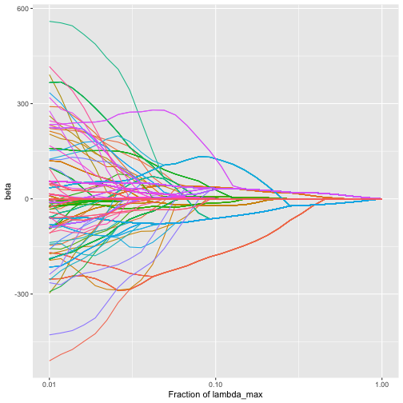
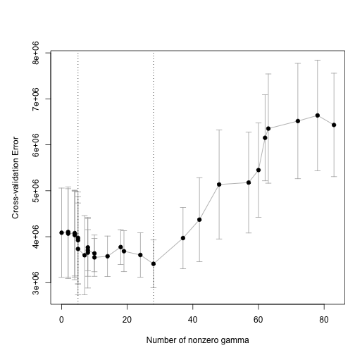

<!--
To knit this vignette, I ran the following within an R console:

knitr::knit("trac-example.Rmd.orig", output = "trac-example.Rmd")

-->


In this vignette, we demonstrate the basic usage of the `trac` package, which implements the methodology from [Tree-Aggregated Predictive Modeling of Microbiome Data](https://www.biorxiv.org/content/10.1101/2020.09.01.277632v1.full).  We use the Gut (HIV) data set, one of the main examples in the paper, which is included in the `trac` package as `sCD14`.  For more on this data set, see `?sCD14`.

The `trac` package assumes that you want to predict some response variable based on amplicon data^[or more generally any kind of compositional data], where the amplicons are structured on a tree.

To apply `trac`, one needs three things:

1. A response vector `y` of length `n`, where `n` is the number of samples.

2. A `n`-by-`p` data matrix `x`, where `p` is the number of leaves (i.e., the number of taxa at the base level, which in this example is the OTU level).

3. A binary matrix `A` with `p` rows and a column for each non-root node of the tree.  In particular, element `A[j,u]` indicates whether leaf `j` has ancestor `u`.

A look at the `sCD14` data object reveals that it has these three elements in addition to two other objects:


```r
library(trac)
names(sCD14)
#> [1] "y"    "x"    "tree" "tax"  "A"
```

The object `tree` is of class `phylo` and is useful for plotting.  The object of class `tax` is convenient for seeing the ancestor taxa of a leaf.

If you are starting with a `phyloseq` object, you can use the functions `tax_table_to_phylo` and `phylo_to_A` to form the `tree` and `A` objects.  See [here]() for a demonstration of this workflow (which describes details of how to handle unclassified taxa and data sets with multiple kingdoms).

### Set up train/test splits and take logarithm

Let's start by splitting the data into a train and test set.  We'll take 2/3 of the observations for training.


```r
set.seed(123)
ntot <- length(sCD14$y)
n <- round(2/3 * ntot)
tr <- sample(ntot, n)
```

Since `trac` operates in the log-contrast framework, we take the log of the feature matrix.


```r
log_pseudo <- function(x, pseudo_count = 1) log(x + pseudo_count)
ytr <- sCD14$y[tr]
yte <- sCD14$y[-tr]
ztr <- log_pseudo(sCD14$x[tr, ])
zte <- log_pseudo(sCD14$x[-tr, ])
```

### Apply trac

We now solve the `trac` optimization problem using a path algorithm (implemented in the [c-lasso](https://c-lasso.readthedocs.io/en/latest/) Python package).  The function `trac` returns the solutions for a grid of values of the tuning parameter $\lambda$.  The grid's minimal value and number of points are controlled by `min_frac` and `nlam`, respectively.


```r
fit <- trac(ztr, ytr, A = sCD14$A, min_frac = 1e-2, nlam = 30)
```
By default, `trac` gives us the model known as "trac (a=1)" in the [paper](https://www.biorxiv.org/content/10.1101/2020.09.01.277632v1.full).  For other choices of weights, see the section on weights below.

### Looking at the `trac` output

We can look at the trac regularization path.  By default, the function `plot_trac_path` shows the `alpha` coefficients.


```r
plot_trac_path(fit)
```


There is an `alpha` coefficient corresponding to each node of the tree. For example, early in the path we have the following:


```r
show_nonzeros <- function(x) x[x != 0]
show_nonzeros(fit[[1]]$alpha[, 2])
#> Life::Bacteria::Firmicutes::Clostridia::Clostridiales::Ruminococcaceae 
#>                                                               306.4128 
#> Life::Bacteria::Firmicutes::Clostridia::Clostridiales::Lachnospiraceae 
#>                                                              -306.4128
```

We can also plot the `beta` values (coefficients corresponding to the leaf taxa):


```r
plot_trac_path(fit, coef = "beta")
```



We see that as the amount of regularization increases, the individual `beta` coefficients tend to fuse together (corresponding to the aggregation of taxa induced by the trac regularizer).

Next, we would like to select a value of the tuning parameter.  We do so using cross validation.


### Cross validate trac to choose tuning parameter

The function `cv_trac` by default performs 5-fold cross validation.


```r
cvfit <- cv_trac(fit, Z = ztr, y = ytr, A = sCD14$A)
#> fold 1
#> fold 2
#> fold 3
#> fold 4
#> fold 5
```

We can use the function `plot_cv_trac` to visualize.


```r
plot_cv_trac(cvfit)
```



The two vertical lines show us the minimum of the CV curve and the "1 SE rule" solution.


```r
cvfit$cv[[1]]$ibest
#> [1] 20
cvfit$cv[[1]]$i1se
#> [1] 8
```

Using the 1SE rule results in the following nonzero `alpha` coefficients.


```r
show_nonzeros(fit[[1]]$alpha[, cvfit$cv[[1]]$i1se])
#>                                                         Life::Bacteria::Actinobacteria 
#>                                                                              -501.4344 
#> Life::Bacteria::Bacteroidetes::Bacteroidia::Bacteroidales::Bacteroidaceae::Bacteroides 
#>                                                                               286.8039 
#>                 Life::Bacteria::Firmicutes::Clostridia::Clostridiales::Ruminococcaceae 
#>                                                                              2221.7521 
#>                 Life::Bacteria::Firmicutes::Clostridia::Clostridiales::Lachnospiraceae 
#>                                                                             -1644.8563 
#>                                                                         Life::Bacteria 
#>                                                                              -362.2653
```
### Making predictions

We can apply our `trac` model to make predictions on the test set and compute the mean squared error on the test set.


```r
yhat_te <- predict_trac(fit, new_Z = zte)
testerr <- colMeans((yhat_te[[1]] - yte)^2)
nnz <- colSums(fit[[1]]$alpha != 0)
```

And we can make a plot of the test error as a function of the number of non-zero `alpha` coefficients.


```r
library(tidyverse)
tibble(nnz = nnz, testerr = testerr) %>%
  ggplot(aes(x = nnz, y = testerr)) +
  geom_point() +
  geom_vline(xintercept = nnz[cvfit$cv[[1]]$i1se])
```


### Weights

The user can specify any set of node-specific weights in the penalty.  As described in the trac paper, a straightforward choice is to take a power of the number of leaves under that node:

$$
w_u=|L_u|^{-a}.
$$
With apologies to the user, the weights notation is overloaded, which means that the notation `w` in the function `trac` and the $w$ referred to in the paper are different from each other in a way we explain now.  In the package, the weights `w` refer to the weights on the trac optimization problem parameterized in terms of `gamma` whereas in the paper's equation (2), $w$ refers to the weights on the trac optimization problem parameterized in terms of `alpha`.  As explained in the appendix of the paper, $\alpha_u=\gamma_u\cdot|L_u|$.  This means that the weights we use in the package should be taken to be `|L_u|` times larger than what they are in the paper.

Thus, when the paper writes "trac (a=1)", this corresponds to the `trac` function getting an input `w` of all ones (which is the default).  When the paper writes "trac (a=1/2)", this corresponds to the `trac` function called as follows:


```r
fit2 <- trac(ztr, ytr, A = sCD14$A, min_frac = 1e-2,
             nlam = 30, w = Matrix::colSums(sCD14$A)^0.5)
```


### Other base levels

The `trac` package can perform its flexible and data-adaptive aggregation starting from any base level of aggregation.  In the above, we started with OTU-level data on the leaves of the tree.  However, some users may prefer to first aggregate to a fixed level by summing all counts within a certain taxonomic level.  For example, we could start by aggregating to the family level before applying `trac`:


```r
sCD14_family <- aggregate_to_level(sCD14$x, sCD14$y, sCD14$A, sCD14$tax, level = 6, collapse = TRUE)
```

We can now proceed as before


```r
fit_family <- trac(log_pseudo(sCD14_family$x[tr, ]),
                   sCD14_family$y[tr],
                   sCD14_family$A,
                   min_frac = 1e-2, nlam = 30)
```

### Sparse Log-Contrast

One can also fit sparse log-contrast models in `trac`.


```r
fit_slc <- sparse_log_contrast(ztr, ytr, min_frac = 1e-2, nlam = 30)
```


```r
cvfit_slc <- cv_sparse_log_contrast(fit_slc, Z = ztr, y = ytr)
#> fold 1
#> fold 2
#> fold 3
#> fold 4
#> fold 5
yhat_te_slc <- predict_trac(list(fit_slc), new_Z = zte)[[1]]
testerr_slc <- colMeans((yhat_te_slc - yte)^2)
nnz_slc <- colSums(fit_slc$beta != 0)
```


```r
tibble(nnz = nnz_slc, testerr = testerr_slc) %>%
  ggplot(aes(x = nnz, y = testerr)) +
  geom_point() +
  geom_vline(xintercept = nnz[cvfit$cv[[1]]$i1se])
```


